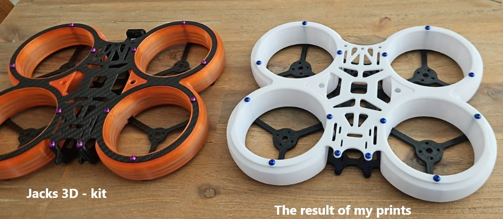
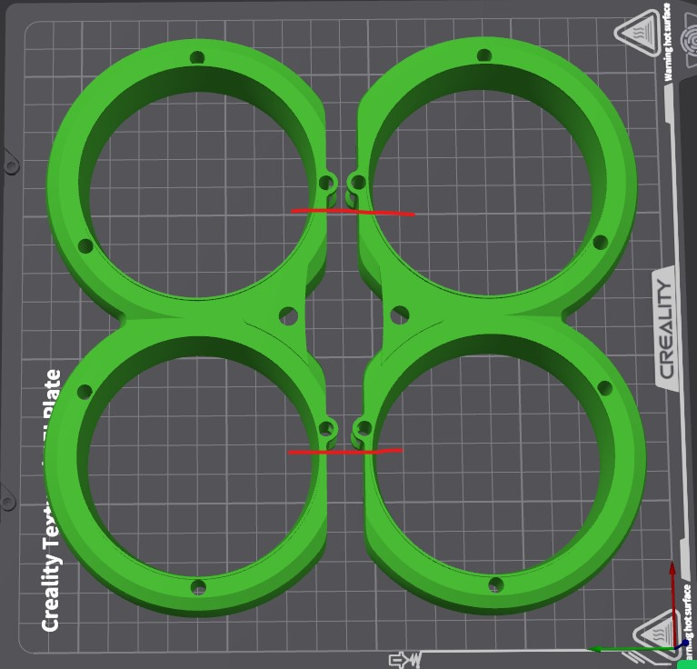

# Splash FPV Drone

These files orginally came from [jacks3dprinting](https://www.thingiverse.com/thing:4741274/files), check out the facebook group [jacks 3d printing](https://www.facebook.com/groups/315905552404441)

## 2020_BOTTOM

The file comes as .dxf which I think is for laser cutting from carbon fiber, this is what the kit comes with from my [local hobby shop](https://www.quadjunkie.co.nz/product/splash-cinewhoops-from-jacks-3d/). Although I have my doubts about rigidity and actually flying I figured I'd 3D print the whole drone from PETG and see what happens. This was how I converted the files

1. Open 2020_BOTTOM.dxf in [Fusion 360](https://www.autodesk.com/products/fusion-360/), I use their Education License but the product is too complicated for me
1. Extrude the main shape by 5mm and export as 2020_BOTTOM.step
1. Open 2020_BOTTOM.step in [Onshape](https://www.onshape.com/en/), this product is much easier for my simple brain
1. My 3D printer is a K1C with a max print volumn of 220x220x250, so I [chopped off each side by 3.05mm to make it fit](https://cad.onshape.com/documents/10d304fa08ec89b5c3c82cf4/w/95be4216cc5ec3a5ac78ad2f/e/0e5da90423fec7daeeb563ab), I dont think this was smart in terms of design but Ive done dumber things in my time on earth
1. Export as `splash bottom.stl` and print, the only setting I changed was the wall loops/count = 7

### Bottom v2

The hole pattern in the splash is `8x8mm` but the cheap [iFlight 2207 2750kv](https://www.quadjunkie.co.nz/product/iflight-xing-e-pro-2207-2-6s-fpv-motor/) motors I found from my local hobby shop are `10x10m` so I adapted the design in onshape, same link as above.

1. The orginal I printed was `5mm`, this one I tried as `3mm`
1. Print `splash bottom v2.stl` with wall loops/count = 7

## DuctSMA

I think the kit prints these with TPU but Ive never tried soft plastic so instead I just rolled with PETG. I needed to use a mirror feature in the slicer to make this work, the helpful dudes at [jacks 3d printing](https://www.facebook.com/groups/315905552404441) explained this to me

1. Open DuctSMA.STL on your slicer, I used Creality Print 6.0 and rotate it flat with the bottom of the circles on the flat side
1. Mirror -> Along X Axis, this moves the center holes on that axis
1. OPen a second DuctSMA.STL on the same bed, rotate flat and then rotate so the parts face each other
1. The center notches now match up
1. Print with standard settings but with 10% infil with grid pattern

## 2020_TOP

Same as 2020_BOTTOM except I used 2mm thickness and removed 3mm from either side, my [onshape doc is here](https://cad.onshape.com/documents/a7605b4517a8a1863d6d50e7/w/2daf4fa2031e767b9879f13f/e/a5c888149138a796a213c25a)

The resulting stl is `splash top.stl`